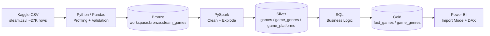

# Steam Store BI Lakehouse

End-to-end BI project: raw Kaggle data → Medallion Lakehouse (Databricks Free Edition) → Power BI dashboard. Built specifically around the stack required for an **Administrative BI Assistant** role: Python, SQL, Databricks, PySpark/Delta Lake, Power BI/DAX.

## Screenshots

*(adjust filenames to match what's actually committed under `docs/screenshots/`)*

| Market Overview | Pricing & Reviews | Temporal Trends |
|---|---|---|
|  |  |  |

## Business Problem

> How can a digital game store understand market trends, pricing strategies, and platform performance to optimize its catalog and marketing?

## Architecture



| Layer | Tool | Role |
|---|---|---|
| Bronze | Databricks / Delta | Raw, unmodified, auditable landing zone |
| Silver | PySpark | Cleaned, typed, correct grain (genres/platforms exploded) |
| Gold | SQL | Business-ready fact table + bridge, scoped to what the dashboard needs |
| BI | Power BI | Import-mode semantic model, DAX computed live against filters |

## Tech Stack

Python (Pandas) · SQL · Databricks Free Edition (Unity Catalog, serverless) · PySpark · Delta Lake · Power BI Desktop / DAX

## Repo Structure

```
steam-bi-lakehouse/
├── README.md · .gitignore · requirements.txt
├── data/                # local, gitignored, regenerable (raw + bronze CSV)
├── src/extract/          # Python download/profiling script
├── notebooks/            # exploratory profiling
├── databricks/            # Bronze/Silver/Gold notebook source (PySpark + SQL)
├── sql/                   # independent validation queries — answer key, not a data source
├── powerbi/                # steam_dashboard.pbix + dax_measures.md (DAX as versionable text)
└── docs/                   # data dictionary, profiling report, screenshots
```

Four categories, kept physically separate on purpose: **environment** (`.gitignore`, `requirements.txt`) defines how to reproduce the setup; **execution code** (`src/`, `databricks/`, `sql/`, `dax_measures.md`) is the logic, versioned and reviewable; **artifacts** (`data/`, `.pbix`) are regenerable outputs, not hand-maintained; **documentation** (this file, `docs/`) is for humans, not machines.

## The Dataset

[Steam Store Games](https://www.kaggle.com/datasets/nikdavis/steam-store-games) (Kaggle, ~27K titles). Only `steam.csv` is used — the dataset ships five other files (descriptions, media, requirements, SteamSpy tags), none of which anything in this project's scope needed; pulling them in would have added join complexity with no analytical payoff.

**This is a static, dated snapshot** — the data stops at **2019-05-01** (confirmed via `MAX(release_date)`, not assumed). It does not reflect Steam's current catalog, and every finding below describes "Steam as of mid-2019," not "Steam today."

## Medallion Architecture

**Bronze** is a faithful, unmodified copy of the source, landed via a Unity Catalog Volume and written as Delta — deliberately *not* cleaned here. Phase 1 (Python) does profiling and light structural validation only (primary-key uniqueness, no fully-empty rows); real transformation logic is reserved for Silver. This matters because Bronze is the audit trail — if something breaks downstream, you can always get back to exactly what was ingested, and Delta's version history (`DESCRIBE HISTORY`) means even a corrected Bronze table still has its prior (buggy) version recoverable.

**Silver** (PySpark) fixes two things and only two things: types/nulls, and grain. `genres` and `platforms` arrive as semicolon-delimited strings (85% of games carry more than one genre) and get exploded into bridge tables — `game_genres`, `game_platforms` — alongside a cleaned one-row-per-game `games` table. `categories` and `steamspy_tags` are also multi-valued but unused by any dashboard page, so they stay as raw text columns rather than getting bridge tables nobody would query. `owners` (a SteamSpy-estimated range like `"0-20000"`) is parsed into min/max/avg — explicitly an estimate, since Steam has never published exact owner counts.

**Gold** (SQL) is a single fact table (`fact_games`) plus a genre bridge, scoped tightly to the three dashboard pages: price tiers grounded in the actual quartiles from Phase 1 profiling (not round numbers picked by eye), platforms flattened into `has_windows`/`has_mac`/`has_linux` booleans (only 3 possible values — no need for a bridge table here, unlike genres), and raw `positive_ratings`/`negative_ratings` kept alongside a pre-computed `positive_review_rate` so DAX has the addable components it needs for a correctly weighted aggregate later. Gold is deliberately **not** pre-aggregated — no baked-in KPI tables — because Power BI's slicers need live data to filter against; if Gold already contained "Average Price," there'd be nothing left for a year or genre filter to recompute.

## Data Quality Investigation: The CSV Escape-Character Bug

While building Silver, three sequential cast operations failed:

1. `owners → BIGINT` crashed on the value `"7.19"` — a price, not an owner-count range
2. `release_date → DATE` crashed on a game name string
3. `english → BOOLEAN` crashed on a date string

Investigating the pattern instead of patching each error individually surfaced one cascading root cause: two rows (`appid 595280`, `817820`) had their columns shifted. `817820`'s name is `The "Quiet, Please!" Collection` — the embedded quotes were the trigger.

**Root cause:** Spark's CSV reader defaults to backslash (`\`) as its escape character, not the RFC 4180-standard doubled double-quote (`""`) the source file actually uses. Without explicitly setting `.option("escape", '"')`, `spark.read.csv()` lost track of quote-balance on that row — and the broken state bled into the neighboring row (`595280`) until the parser re-synced. The original Kaggle file and the Phase 1 Pandas export were both unaffected; the bug was isolated to the Bronze ingestion step.

**Fix:** re-ingested Bronze with explicit `.option("quote", '"').option("escape", '"')` and `overwriteSchema=true` (required, since correct parsing changed the inferred type of the previously-corrupted columns). Verified both rows parsed correctly afterward — and, as confirmation the fix generalized rather than patched just those two rows, a developer name with the same embedded-quote pattern (`Nikita "Ghost_RUS"`) also rendered correctly downstream.

Defensive `try_cast`/`try_to_date`/`regexp_extract` handling was kept in Silver even after the root-cause fix — as standing resilience practice, not a substitute for it. Full technical write-up: [`docs/profiling_report.md`](docs/profiling_report.md).

## Key Design Decisions

| Decision | Reasoning |
|---|---|
| Only `steam.csv` used, not the dataset's other 5 files | Nothing in scope needed them; avoids join complexity with no payoff |
| Bronze = light validation only, no business cleaning | Preserves an auditable raw copy; real cleaning belongs in Silver |
| Only genres + platforms get bridge tables (not categories/tags) | Only fields the dashboard actually uses |
| Platforms → booleans in Gold, bridge table in Silver | Only 3 possible values — no combinatorial risk, unlike genres |
| Price tiers from Phase 1's actual quartiles | Cutoffs reflect the real distribution, not arbitrary round numbers |
| Raw `positive_ratings`/`negative_ratings` kept, not just a rate | DAX needs addable components for a correctly weighted aggregate |
| Gold has its own `game_genres`, not a passthrough to Silver | Power BI depends only on Gold — one stable contract layer |
| `sql/*.sql` is a validation layer, not a Power BI source | Written *before* DAX, as an answer key, to catch bugs, not confirm them |
| Import mode, not DirectQuery | Fits comfortably in memory; avoids burning serverless quota per click |
| `fact_games` ↔ `game_genres` relationship set to bidirectional | Default single-direction would silently break genre slicers |
| Year table instead of a full daily calendar | Every temporal need here is year-grain; a full calendar would be unused precision |
| `YoY Release Growth` returns `BLANK()` for 2019 | Data ends 2019-05-01 — a partial year isn't a comparable growth rate |
| Genre share charted as bars, never pie/donut | Genres are multi-label — shares don't sum to 100% |
| `is_free` charted as a donut | Unlike genre, this field is genuinely binary and exhaustive |
| Chart titled "Top 10 Publishers by Game Count," not "Market Share" | Even the top publisher holds under 1% of the catalog |

## Key Findings

- **The catalog is indie-dominated**: 71.7% of games carry an "Indie" tag — more than 1.5× the next most common genre (Action, 44.0%).
- **Price is right-skewed**: median $3.99, mean $6.71 (paid games only). Nearly half the catalog (49.1%) sits in the $0.01–$4.99 "Budget" tier.
- **Price and review quality are essentially uncorrelated** (r ≈ 0.08) across the full catalog — worth reading as a scatter plot rather than a headline number, since a near-zero *global, linear* correlation doesn't rule out patterns within specific segments.
- **Windows support is near-universal** — only 5 of 27,075 games lack it. "Platform evolution" here is really a story about Mac/Linux adoption over time, not Windows.
- **No developer or publisher meaningfully dominates** — the top publisher (Big Fish Games) holds under 1% of the catalog. This is a long-tail market, not a concentrated one.
- 9.5% of the catalog is free-to-play.

## DAX Layer

Full formulas and rationale for every measure live in [`powerbi/dax_measures.md`](powerbi/dax_measures.md) — kept as a separate text file specifically because the `.pbix` is a binary blob that doesn't diff in git. One example, since it's the clearest illustration of a real trap avoided:

```dax
Positive Review Rate = 
DIVIDE(SUM(fact_games[positive_ratings]), SUM(fact_games[total_ratings]))
```

This is a ratio of sums, not `AVERAGE()` of the per-game rate column — averaging the rate directly would weight a 3-review game the same as a 500,000-review game.

## Dashboard Pages

1. **Market Overview** — Total Games / Average Price KPI cards, genre distribution (top 15, horizontal bar)
2. **Pricing & Reviews** — price tier breakdown (custom-sorted), free-vs-paid donut, price-vs-review-rate bubble scatter (sized by rating volume, with trend line)
3. **Temporal Trends** — releases-by-year combo chart with YoY growth line (2019 visually flagged as partial), platform adoption over time, Top 10 Publishers

## Known Limitations & Future Work

- **Not published to Power BI Service.** Tenant creation requires a work/school email; this was built on a personal account, and the goal was a portfolio artifact, not a live deployment. The `.pbix` and screenshots in this repo are the artifact of record.
- The **$421.99 max price** outlier (flagged in Phase 1 profiling) was never individually investigated — a reasonable next step if extending this project.
- `categories` and `steamspy_tags` are cleaned and available in Silver but not modeled into Gold — no page needed them. Extending the dashboard with either would mean adding a dedicated bridge table, following the same pattern as genres/platforms.
- `average_playtime`/`median_playtime` are excluded from every KPI — SteamSpy's coverage is sparse enough (catalog-wide median of 0) that an aggregate built on them would mislead without heavy caveats.
- Data quality validation here covers what was actually checked (nulls, duplicates, structural format, the CSV parsing bug) — it isn't a guarantee every row is clean. The CSV bug itself was only caught because it happened to crash a cast; a corruption that didn't crash anything could still be sitting undetected.

## How to Reproduce

```bash
pip install -r requirements.txt
python src/extract/download_kaggle.py
```

Then, in order: run `databricks/bronze/01_ingest_bronze.py` → `databricks/silver/02_clean_transform_silver.py` → `databricks/gold/03_build_gold_tables.sql` in a Databricks Free Edition workspace, run `sql/validate_*.sql` to confirm your numbers match the ones documented here, then connect `powerbi/steam_dashboard.pbix` (or rebuild the connection) using your own Databricks server hostname / HTTP path.

## Project Status

| Phase | Status |
|---|---|
| 1. Python ETL & Profiling | Done |
| 2. Databricks Medallion Setup | Done |
| 3. SQL Analytics & Gold Tables | Done |
| 4. Power BI Modeling & DAX | Done |
| 5. Documentation | Done |
| 6. Build web page using FastAPI + React | In Progress... |